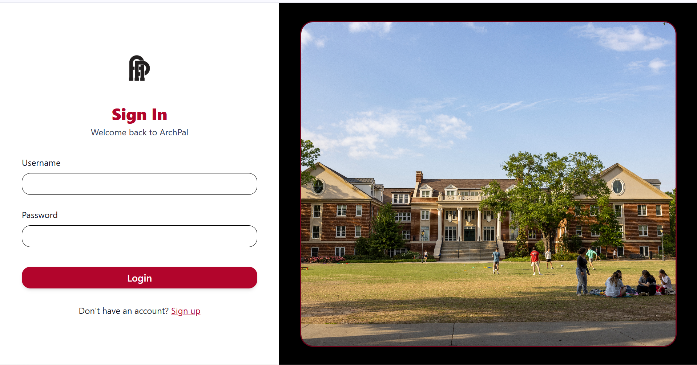
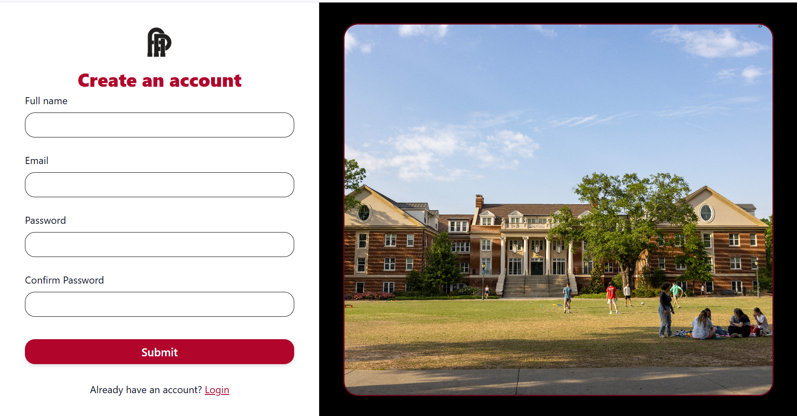
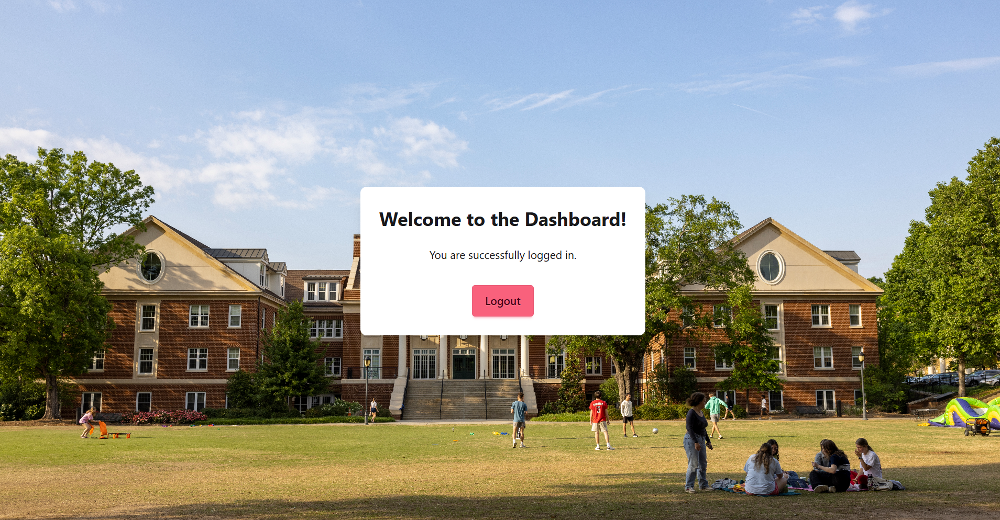

# ArchPal Authentication Module
  
## Structure
* `/archpal` - Main authentication logic
* `/core` - Core authentication functions
* `/theme` - UI/theme components for login
* `manage.py` - Management script

---

To see the actual webpages, you need to run Django locally:
```bash
# Navigate to auth folder
cd auth

# Run the server
python manage.py runserver

# Open in browser
http://localhost:8000/login
```

### Or View Screenshots Below

I've added screenshots of all the authentication pages so you can see what they look like without running the app.

---

## Screenshots

### Login Page


**Template Location:** `core/templates/registration/login.html`

---

### Signup Page


**Template Location:** `core/templates/registration/signup.html`

---

### Dashboard Page


**Template Location:** `core/templates/dashboard.html`

---

## HTML Login Button

For archpal.org homepage:

**Temporary (for testing):**
```html
<a href="https://hnoyuct2eb34ob3yfp4weanuyq0obyas.lambda-url.us-east-2.on.aws/" 
   style="display: inline-block; padding: 12px 24px; background-color: #BA0C2F; 
   color: white; text-decoration: none; border-radius: 5px; font-weight: bold;">
  Login with UGA SSO
</a>
```

**Permanent (once deployed):**
```html
<a href="" 
   style="display: inline-block; padding: 12px 24px; background-color: #BA0C2F; 
   color: white; text-decoration: none; border-radius: 5px; font-weight: bold;">
  Login with UGA SSO
</a>
```

---

## Quick Summary

- **To view webpages:** Run `python manage.py runserver` in the auth folder
- **To see design:** View screenshots above
- **Login template:** `core/templates/registration/login.html`

---
